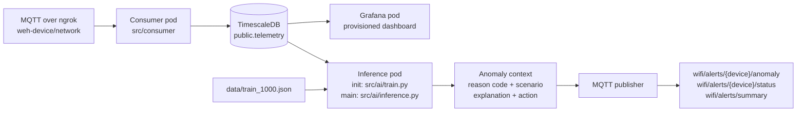
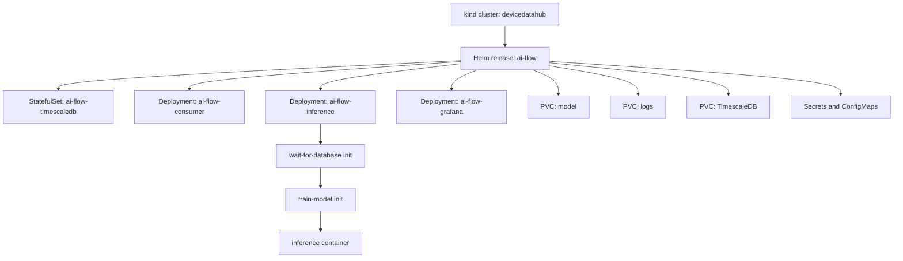

# DeviceDataHub AI architecture

## Runtime flow

## Kubernetes components

## Startup sequence

1. `scripts/start_linux.sh` creates and activates `.venv`.
2. `scripts/startup.py` installs or locates `kind`, `kubectl`, and Helm.
3. Docker builds the single application image.
4. kind loads the image into cluster nodes.
5. Helm creates storage, credentials, database, Grafana, consumer, and inference resources.
6. TimescaleDB becomes ready through its PostgreSQL readiness probe.
7. Consumer and inference wait for a usable database connection.
8. The inference init container trains on 1,000 records and writes `model.pkl`.
9. The inference container loads the model and polls recent telemetry.
10. Anomalies are published with actionable context to MQTT.
11. Linux port-forwards expose Grafana on port `3000` and TimescaleDB on port `5433`.

## Data contracts

### Telemetry input

The consumer expects JSON MQTT messages containing a `network` array with Wi-Fi
radios and `radio_stats`. Valid Wi-Fi radio rows are normalized and written to
`public.telemetry`.

### Model input

`src/ai/train.py` reads `data/train_1000.json`, uses the labeled `label` field, and
writes a serialized LightGBM model with feature columns and scaler metadata to
`model_artifacts/model.pkl`.

### Anomaly output

Inference publishes:

- `reason_code`: stable machine-readable classification
- `scenario`: training-aligned human-readable scenario
- `layman_explanation`: plain-language problem description
- `recommended_action`: suggested operational response
- `anomaly_prob`: model confidence
- `published_to_mqtt`: actual publish result
