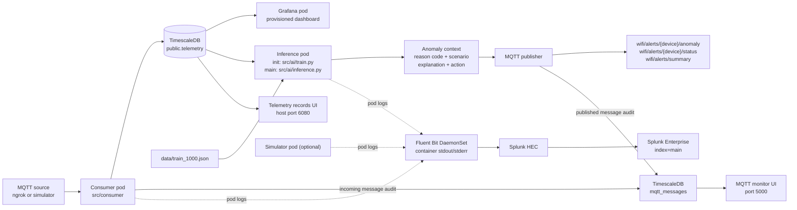
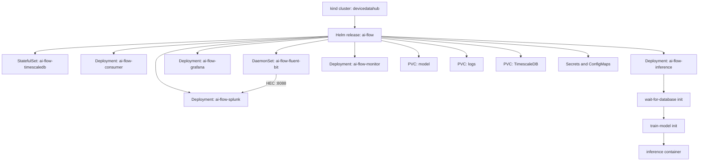

# DeviceDataHub AI architecture

## Runtime flow

```mermaid
flowchart LR
    M["MQTT source<br/>ngrok or simulator"] --> C["Consumer pod<br/>src/consumer"]
    C --> T[("TimescaleDB<br/>public.telemetry")]
    T --> G["Grafana pod<br/>provisioned dashboard"]
    T --> I["Inference pod<br/>init: src/ai/train.py<br/>main: src/ai/inference.py"]
    D["data/train_1000.json"] --> I
    I --> A["Anomaly context<br/>reason code + scenario<br/>explanation + action"]
    A --> P["MQTT publisher"]
    P --> M2["wifi/alerts/{device}/anomaly<br/>wifi/alerts/{device}/status<br/>wifi/alerts/summary"]
    LF["Fluent Bit DaemonSet<br/>container stdout/stderr"] --> HEC["Splunk HEC"]
    HEC --> SPL["Splunk Enterprise<br/>index=main"]
    C -->|incoming message audit| DBM["TimescaleDB<br/>mqtt_messages"]
    P -->|published message audit| DBM
    DBM --> MU["MQTT monitor UI<br/>port 5000"]
    T --> TU["Telemetry records UI<br/>host port 6080"]
    C -. pod logs .-> LF
    I -. pod logs .-> LF
    SIM["Simulator pod (optional)"] -. pod logs .-> LF
```

## Kubernetes components

```mermaid
graph TD
    K["kind cluster: devicedatahub"]
    H["Helm release: ai-flow"]
    K --> H
    H --> DB["StatefulSet: ai-flow-timescaledb"]
    H --> C["Deployment: ai-flow-consumer"]
    H --> I["Deployment: ai-flow-inference"]
    H --> G["Deployment: ai-flow-grafana"]
    H --> SP["Deployment: ai-flow-splunk"]
    H --> FB["DaemonSet: ai-flow-fluent-bit"]
    H --> MON["Deployment: ai-flow-monitor"]
    H --> V1["PVC: model"]
    H --> V2["PVC: logs"]
    H --> V3["PVC: TimescaleDB"]
    H --> S["Secrets and ConfigMaps"]
    FB -->|HEC :8088| SP
    I --> W["wait-for-database init"]
    W --> TR["train-model init"]
    TR --> INF["inference container"]
```

## Startup sequence

1. `scripts/start_linux.sh` creates and activates `.venv`.
2. `scripts/startup.py` installs or locates `kind`, `kubectl`, and Helm.
3. Docker builds the single application image.
4. kind loads the image into cluster nodes.
5. Helm creates storage, credentials, database, Grafana, Splunk, Fluent Bit, consumer, and inference resources.
6. TimescaleDB becomes ready through its PostgreSQL readiness probe.
7. Consumer and inference wait for a usable database connection.
8. The inference init container trains on 1,000 records and writes `model.pkl`.
9. The inference container loads the model and polls recent telemetry.
10. Anomalies are published with actionable context to MQTT.
11. Fluent Bit reads container logs, adds Kubernetes metadata, filters to the `devicedatahub` namespace, and sends events to Splunk HEC.
12. The monitor UI reads MQTT message audits and telemetry directly from TimescaleDB; its pages auto-refresh and support time-range filters and descending pagination.
13. Linux port-forwards expose Grafana on `3000`, TimescaleDB on `5433`, Splunk Web on `4000`, MQTT history on `5000`, and telemetry rows on host port `6080` to container port `6000`.

Splunk is used for log search across both the external MQTT and simulator flows.
The collector excludes its own and Splunk's pods to prevent log feedback loops.
Events are indexed in `main` with namespace, pod, and container metadata.
Splunk Web is available at `http://localhost:4000`; sign in as `admin` with
password `admin123`. Shutdown preserves the HEC credentials file for subsequent
runs.

The MQTT monitor at `http://localhost:5000` shows incoming and published payloads
stored in `public.mqtt_messages`. The TimescaleDB viewer at
`http://localhost:6080` (host port `6080` to container port `6000`) shows
telemetry rows from `public.telemetry`, the same records queried by Grafana.
Both monitor pages refresh every 30 seconds and support 5-minute, 15-minute,
1-hour, 24-hour, and all-time views with newest-first pagination.

## Data contracts

### Telemetry input

The consumer expects JSON MQTT messages containing a `network` array with Wi-Fi
radios and `radio_stats`. Valid Wi-Fi radio rows are normalized and written to
`public.telemetry`.

### Model input

`src/ai/train.py` reads `data/train_1000.json`, uses the labeled `label` field, and
writes a serialized LightGBM model with feature columns and scaler metadata to
`model_artifacts/model.pkl`.

### Anomaly output

Inference publishes:

- `reason_code`: stable machine-readable classification
- `scenario`: training-aligned human-readable scenario
- `layman_explanation`: plain-language problem description
- `recommended_action`: suggested operational response
- `anomaly_prob`: model confidence
- `published_to_mqtt`: actual publish result
